# Flash Memory
On STM32 boards, programs are stored in Flash Memory. They can be also directly executed from Flash: SRAMs are usually too small to fit also the code, and are reserved only for stacks/runtime data.

## Flash Programming
Flash memory differs from standard memory for what concerns writes. 

In order to reprogram flash memory, a `in-application programming (IAP)` is needed: IAP allows the user to re-program the Flash memory while the application is running (*the CPU will likely stall during the operation*).

Flash memory is divided into erase sectors, which can be in some cases also of different sizes and rather large (i.e. STMF4, STMF7, ...).

- An erase-sector is the minimum granularity for an erase operation. *Erasing a sector sets all bits in the sector to 1*.

- Writes must be performed with the granularity of the specific Flash memory (in some cases can be modified using an apposite register for parallelism). Usually goes from a byte (*8 bits*) to a full word (*64 bits*).

- When setting bits from 1 to 0 no erase is required, if the hardware supports it. But it's not possible to perform the opposite operation without erasing the whole sector first.

### STM32 Flash
On some devices, STM adopted a more strict specification for the Flash controller: given the minimum write granularity, it's not possible to write twice to the same word (after an erase). The only exception is writing a full word of 0x00, that is always accepted.

*Example (F303RE): the minimum write granularity is half-word (16 bits). After the page is erased, all half-words are 0xFFFF. The following transition is accepted: 0xFFFF -> 0xXXXX -> 0x0000*

*Example (F401RE): hardware supports the full specification. After the page is erased, all half-words are 0xFFFF. The following transition is accepted: 0xFFFF -> 0xFFFE -> 0xFFFC -> ... -> 0x0000*

All these operations are possible by exploiting the memory-mapped registers of the IAP (`FLASH_SR`, `FLASH_CR`, ...). But first the flash must be unlocked using the ad-hoc key for `FLASH_KEYR`. By setting the `PG` flag (programming flag) in the register `FLASH_CR`, after the unlock procedure, it's possible to issue a "write" to the corresponding flash location, with the right granularity.

Some devices have ECC flash memory (E additional bits every D bits of CRC, although it could vary). **In order to support these devices, each flag below must be set to the size of the data covered by a single ECC control word (D bits)**.

## Flash Layout
The minimum erase granularity complicates the operations needed in order for the system to be updated.

The only hard constraint for the positioning of the code in flash (for Cortex-M4), is the following initial layout:

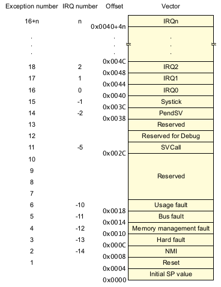


For simplicity, we can start placing all the Kernel code at the beginning of the Flash, along with all entry-points needed by the hardware (*HardFault, DefaultHandler, ...*)

```
+--------------+------+------....
|  0x08000000  | .... |
+--------------+------+------....
|    IVT + Kernel     |
+--------------+------+------....
```

The Kernel can now start, but in order to have a functioning systems also Components must be loaded. Components are placed in Flash as `HBF` files (see `toolchain/HubrisBinaryFormat.md`).

From a design perspective:
- The kernel must be able to find these HBF binaries in flash. As the system can be updated, this information is not known a priori, and must be stored itself in flash.
- A Memory Protection Unit (MPU) is adopted to increase reliability, so HBF must be placed in a way to satisfy MPU strict requirements on *Base Address* and *Size*.
- The HBF must be placed in memory in a way to control fragmentation, or the system can rapidly become impossible to be updated.

### MPU Requirements
The MPU shipped on board of STM32 Cortex-M4 has quite strict requirements. Up to max 8 regions can be created. Each region can be then be split into 8 subregions (each can be enabled/disabled).
Each region:
- has a start address that must be multiple of the MPU size (natural alignment).
- has a size that must be 2^n x 32 bytes.

The main problem for space allocation is the fact that as the size needed by a component increases, we start having less and less suitable base addresses.

# Buddy Allocator
We consider a modified version of this simple allocator, as:

- it allows compaction of memory with little overhead, at the same time showing a little [external fragmentation](https://en.wikipedia.org/wiki/Fragmentation_(computer)#External_fragmentation).
Problems of internal fragmentation are inevitable. 

- if the start address for the allocations is naturally aligned to the size available to the allocator, all splits will be placed to addresses naturally aligned with that split size (see [here, section 1.1](https://cs.au.dk/~gerth/papers/actainformatica05.pdf)). This is great as satisfies as side effect the MPU requirements.

See `RAMMemory.md` for details.

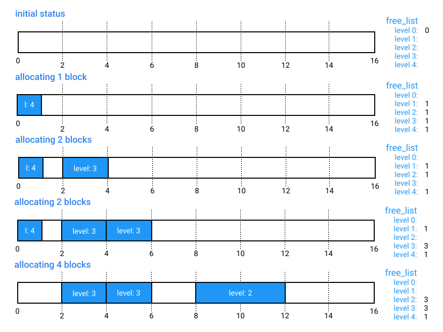

## Storing metadata
One of the critical aspects of the allocator is the ability to reconstruct flash state after an hard reboot. Two different strategies can be used:
- store the metadata about flash layout in a dedicated flash area.
- store the metadata at the beginning of a block itself. As metadata changes always refer to the block we are working on, this avoids the need to have a complex filesystem. The drawback is consuming space of the block.

This second option is considered, due to the constraint resources of the STM32 devices. Each block (apart from the one dedicated to the kernel, more later) starts with an header. This header must be aligned to 4 in size, to avoid problems later.

>The following block header could be further compressed in devices that support the full flash specification (F4, F7, ...). Here is kept generic, assigning to each flag half-word (16bits, 2bytes).

>Unless otherwise specified, all fields with more than one byte are encoded as little-endian.

Offset| Size (bytes) | Field Name  | Possible Values |            Content           |
------|--------------|-------------|-----------------|------------------------------|
0x00  |      2*      | Block Allocated | 0xFFFF = block not allocated<br> 0x0000 = block allocated | Flag meaning this block was once allocated. `Block Level` can be used to determine the allocated size (in use).
0x02  |      2*      | Block Dismissed | 0xFFFF = block not dismissed<br> 0x0000 = block dismissed | Flag meaning this block was then deallocated. `Block Level` can be used to retrieve the old size of the block. 
0x04  |      2*      | Block Finalized | 0xFFFF = block not finalized<br> 0x0000 = block finalized | Flag meaning all the information has been written successfully in this block, and so it's ready to be used. **This flag can be used by the flash allocator to dismiss (erase) at start-up all the blocks pending (0xFFFF).**
0x06  |      2**     | Reserved |  | This space is used to get the correct alignment and keep the header's size a multiple of the minimum write granularity.
0x08  |      2       | Block Level | 0x0000 to 0xFFFF | Integer value representing the level of this block, used to derive the size
0x0A  |      2       | Block Type | 0x0000 to 0xFFFF | Flags representing the destination usage of this block

In particular:
- `Block Type` is read to understand the content of the block. Bits are set low, (0 = on, 1 = off).
    | 15 |...| 7 | 6 | 5 | 4 | 3 | 2 | 1 |     0     |
    |----|---|---|---|---|---|---|---|---|-----------|
    | R  | R | R | R | R | R | R | R | R | COMPONENT |
    
    where:
    - `COMPONENT` means this block contains the code of a component, so an Allocated RAM Base + HBF is expected after the header.

Total size: 12* bytes

>Note: the header's size must be a multiple of 4 (in order to ease alignment of code inside component blocks), but at the same time a multiple of the minimum write granularity, to avoid problems with flags of higher storage level.

>Note: values with * must be set to a multiple of the minimum granularity of flash write, in case of special devices that requires writing more than 2bytes (half-word) at a time. The size of the header must be a multiple of the minimum flash granularity too. 

For example, on L4, being the granularity 64bits (8 bytes), we have the following layout:

Offset| Size (bytes) |   Field Name    |
------|--------------|-----------------|
0x00  |      8       | Block Allocated | 
0x02  |      8       | Block Dismissed | 
0x04  |      8       | Block Finalized |
0x06  |      4       | Reserved        |
0x08  |      2       | Block Level     | 
0x0A  |      2       | Block Type      |

Size: 32 bytes

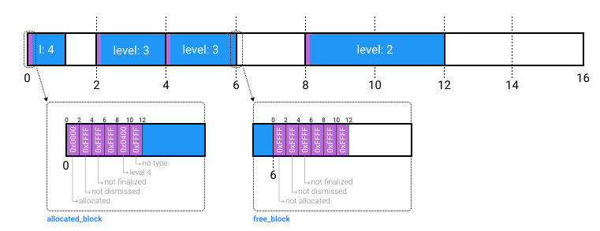

## Terminology
Let's define:
- A `free_block` is a block that was erased, and that can be written in any location. It's not assigned yet. (`ALLOCATED = 0`, `DISMISSED = 0`)
- An `allocated_block` is a block that was allocated, so we must presume it was written. It's locked and cannot be modified. (`ALLOCATED = 1`, `DISMISSED = 0`)
- A `freed_block` is an `allocated_block` after deallocation for it is requested. We must presume it was written, so cannot be used before being erased again. (`ALLOCATED = 1`, `DISMISSED = 1`)

## Reconstructing State from Metadata
It's always possible to retrieve the `free_list` from the flash memory upon start-up, using the following procedure:

1. Start scanning from a fixed position (usually the first address available to the allocator).
2. Read the header at the corresponding position. If the block has:
    - `ALLOCATED = 0`, then surely this is a single `free_block`. Add it to the free list (`#BLOCK = ADDR[BH] / BLOCK_SIZE`), **run buddy merger**, then move ahead of 1 `BLOCK_SIZE`.
    - `ALLOCATED = 1`, then this space is not free (could be `allocated_block` or `freed_block`). Skip this block, moving ahead of `ALLOCATOR_SIZE >> BH.level`.
3. For each block, repeat step 2. When the end of the available space is reached, then terminate.

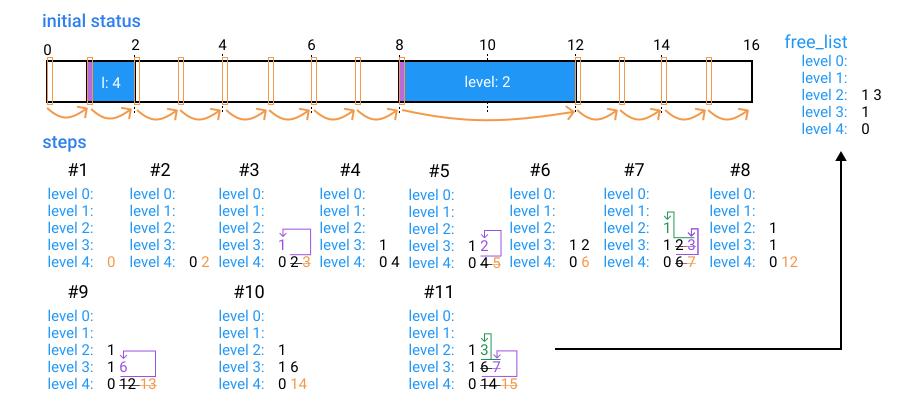

## Constant Flash Page Size
Most devices and flash controllers offers small constant-size pages. For example, considering `STM32F303RE` (that can be found on the `NUCLEO-F303RE`), these blocks are 2Kb in size (see [here](https://www.st.com/resource/en/reference_manual/dm00043574-stm32f303xb-c-d-e-stm32f303x6-8-stm32f328x8-stm32f358xc-stm32f398xe-advanced-arm-based-mcus-stmicroelectronics.pdf)):

| Address Range             | Size (bytes)  |  Name     |
|---------------------------|---------------|-----------|
| 0x0800 0000 - 0x0800 07FF |  2K           | Page 0    |
| 0x0800 0800 - 0x0800 0FFF |  2K           | Page 1    |
| 0x0800 1000 - 0x0800 17FF |  2K           | Page 2    |
| 0x0800 1800 - 0x0800 1FFF |  2K           | Page 3    |
|   .............           |  2K           | ......    |
| 0x0807 F800 - 0x0807 FFFF |  2K           | Page 255  |

In this case, the `BLOCK_SIZE` of the buddy allocator is chosen to be a multiple of the page size (`2Kb`, `4Kb`, ...).
This simplifies a lot the algorithm, that is almost the original one:

>**We assume that the memory was initially completely erased.**

1. At the start of the Flash component, we scan the whole flash, as specified in `Reconstructing State from Metadata`. In a normal case we should find only `allocated_blocks` or `free_blocks`. If we find one `freed_block`, go to **recovery** below.
    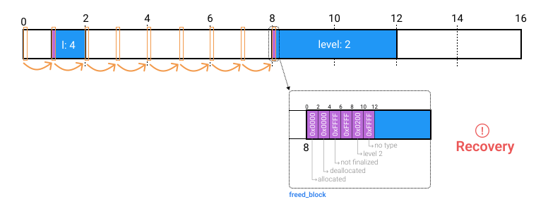
2. upon any block deallocation, we mark the block `DEALLOCATED = 1`. The block covers one or more flash pages. **It's critical to start erasing the pages of the block from the last one up to the one containing the header**: *this ensures consistency in case of system reboot*. Then the whole block is added back to the `free_list`.
    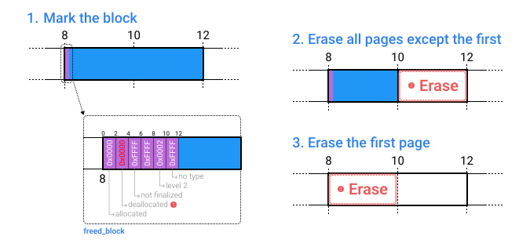
3. upon any block allocation, we search for a candidate `free_block` in the `free_list`. If no block of the requested size is found, try to split another block from an upper `level` of the `free_list`. It's the same behavior of the standard case. If no such block is found, we have no more memory: **the allocation is rejected**.

>*Note: in this version, memory recollection is done actively at any deallocation. As a consequence, we have an unbalanced wearing of the flash in the left side of the space of the allocator, but at the same time the impact on the system for any allocation/deallocation is almost constant (if blocks are small): this approach is advisable for real-time constrained systems.*

>**Note: if a reboot occurs during the erase operation, then the block enters in an undefined state. Depending on the hardware, this could be solved by  checking all `free_blocks` at start-up and erase again if some written data is found: this would solve the situation where the block is marked `free_block`, as only the first two bytes were erased, but then still contains the old data.**

**Recovery**  
If we find one `freed_block` during the initial scan, then this means something interrupted a deallocation. Recover the process by launching the deallocation request on this block (as for point 2 above).
Then scan again, populate `free_list`, and the system is ready!


>*Note: Marking the block as deallocated is needed, otherwise if a reboot occurs while erasing the last pages of the block (but not yet the page containing the block header), then the block apparently is valid, but in practice is missing data.*

### Non-Uniform Flash Page Sizes
This case is the most general, but quite more complex. Various families of STM32 devices (`STM32F4`, `STM32F7`, ...) have quite large flash pages, with different dimensions (for example `STM32F401RE`):

| Address Range             | Size (bytes)  |  Name     |
|---------------------------|---------------|-----------|
| 0x0800 0000 - 0x0800 3FFF |  16K          | Sector 0  |
| 0x0800 4000 - 0x0800 7FFF |  16K          | Sector 1  |
| 0x0800 8000 - 0x0800 BFFF |  16K          | Sector 2  |
| 0x0800 C000 - 0x0800 FFFF |  16K          | Sector 3  |
| 0x0801 0000 - 0x0801 FFFF |  64K          | Sector 4  |
| 0x0802 0000 - 0x0803 FFFF |  128K         | Sector 5  |
| 0x0804 0000 - 0x0805 FFFF |  128K         | Sector 6  |
| 0x0806 0000 - 0x0807 FFFF |  128K         | Sector 7  |

With the following variations to the algorithm, it's possible to use also these devices, at the cost of dedicating one of the biggest flash pages (in use by the allocator) to `SWAP PAGE`. *An alternative is to exploit dedicated external memory for swapping, but the size constraint remains valid.*

The algorithm must ensure de-allocations are done keeping the system consistent, or in any case have the ability to recovery from an unexpected system reboot in any point of the procedure.

>**Assumption: the first block managed by the allocator starts at the beginning of a flash page, and the last block ends at the end of a flash page.** If the allocator covers also the area of the kernel (more at the end), then the first managed block will start at the next free page.

**Challenges**  
There are two main problems:
- an `allocated_block` next to be deallocated can share the same flash page of other `allocated_blocks`, `free_blocks` and `freed_blocks`. It's not feasible anymore to simply erase the page to recover the free space. It's necessary to copy the data to be retained of that page in the swap, erase the page, then copy back data: consistency must be ensured!
- in order to transform a `freed_block` into a `free_block`, the whole block must be erased. The header of the block must be erased only when the remaining part of the block is erased as well, otherwise we would experience unexpected system behaviors.

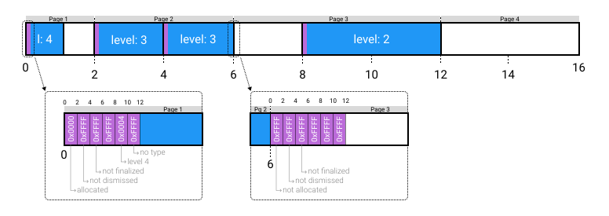

**Changes**  
The algorithm works as the previous case, the only difference now is the deallocation section: 
- when deallocating a block, we must erase this block immediately to avoid having a complex write-ahead logging mechanism.
- erasing a block is not that simple in this case, as it could be sharing the flash page with other `allocated_blocks`. *It's not possible to have more than one `freed_block` in the system, and this simplifies the procedure.* We must use the swap section in order to correctly erase the involved pages without data losses.

The deallocation procedure works as follows:

1. Upon deallocation request, we mark the block with `DEALLOCATED = 1`. *This marker will be used in a write-ahead logging fashion to recover in case a reboot occurs*.

2. Called `#PS` the page containing the header of the block,start scanning the space from the first header location of the allocator, by keeping track of the last header of the page `#PS - 1` (called `PREV_HEADER`). If `#PS` is the first page of the allocator, then `PREV_HEADER` is undefined. A simple algorithm can be used: 
    > Keeping two vars `PREV_HEADER`, `CURR_HEADER`, each time read into `CURR_HEADER` the header. Upon page change, `PREV_HEADER <= CURR_HEADER`. When we reach `#PS`, we stop.

3. Now we get the flash pages that contains even partially this block. We have two different situations:
    - The block is contained in a single page (`#PS`). Go to point *4*.

    - The block overlaps with at least 2 pages. This means it will be at the end of the first (`#PS`), will cover entirely any intermediate page, and will end in the beginning portion of the last page (`#PE`).
        1. We start from page `#PE`. We launch the swap procedure on this page, with arguments:
            - `SC.NUM <= #PE`
            - `SC.START_TYPE <= 2` *(do not preserve)*
            - `SC.START_SIZE <= ADDR[BH] + BH.SIZE - #PE.START_ADDR` *(where `BH.SIZE = ALLOCATOR.SIZE >> BH.LEVEL`)*
        2. For each intermediate page (between `#PE` and `#PS`), we know that the whole area of these pages is a fragment of our block, so we can simply **erase** them (*no swapping needed*). When we reach page `#PS`, go to point *4*.

4. We are now processing the page `#PS`, that contains the block header. We can scan the page by starting from `PREV_HEADER` (found at point *2*). We have two cases:
    - `PREV_HEADER` is not defined: `#PS` is the first page. Just call swapping with:
        - `SC.NUM <= #PS`
        - `SC.START_TYPE <= 0` *(automatic)*
    - `PREV_HEADER` is defined: we could have a block overlapping with the start of this page.
        - If `ADDR[PREV_HEADER] + PREV_HEADER.SIZE = #PS.START_ADDR`: *(the block terminates here, then a valid header is present)*
            - `SC.NUM <= #PS`
            - `SC.START_TYPE <= 0` (*automatic*)
        - If `ADDR[PREV_HEADER] + PREV_HEADER.SIZE > #PS.START_ADDR`:
            - If `PREV_HEADER` states `free_block`, then:
                - `SC.NUM <= #PS`
                - `SC.START_TYPE <= 2` *(do not preserve)*
                - `SC.START_SIZE <= ADDR[PREV_HEADER] + PREV_HEADER.SIZE - #PS.START_ADDR`
            - If `PREV_HEADER` states `allocated_block`, then:
                - `SC.NUM <= #PS`
                - `SC.START_TYPE <= 1` *(preserve)*
                - `SC.START_SIZE <= ADDR[PREV_HEADER] + PREV_HEADER.SIZE - #PS.START_ADDR`
            - *The other case is not possible, as will be resolved at reboot*
        - *The other case is not possible by construction: free space is occupied by `free_blocks`, so we always have something.*

### Swapping
Swapping must be supported at kernel level, in order to be able to swap the block of the Flash component itself during the operation.
The system must also have the ability to recover from this operation if a fault (and reboot) occurs.

**The kernel at start-up ensures the swap page is erased. If not, enters recover procedure explained below.**

**System Call**  
Three fields must be provided to this system call:
- A 16bit number (`SC.NUM`) indicating the flash page to be processed. The value `0xFFFF` is reserved and cannot be used.
- An additional 8bit number (`SC.START_TYPE`) indicating:
    - `0` whether this page starts with a valid header
    - `1` whether this page starts with data that must be preserved (in this case, its length must be indicated in the next integer)
    - `2` whether this page start with data that must not be preserved (in this case, its length is interpreted as how many bytes to skip to get the next valid header, if any.
- A 32bit integer (`SC.START_SIZE`) indicating the length as specified for option `1` and `2`. For option `0` it's a don't care. *Should be less than the page size, as a simple erase can be performed in that case*.

**Algorithm**  

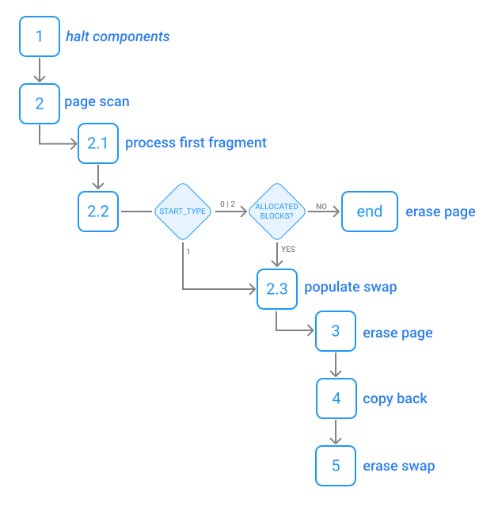

The procedure involves the following steps:
1. *If context switches are allowed during this procedure, the kernel scans the list of active components, determining for each if their code actually intersect with this page (by using the address of their HBF + their size). Any involved component is temporarily put on hold (will not be scheduled in a context switch).*
2. Begin scanning the page. The first fragment can be deduced from the arguments of the system call, the other fragments are detected by reading the block headers.
    1.  Read the arguments of the system call, and perform the steps below. 
        - If `SC.START_TYPE = 0`, then follow the normal procedure (go to point *2.2*) with `PG.POS <= 0`. 
        - If `SC.START_TYPE = 1`, write the flash page number of the target page being swapped in the beginning of the swap page (`PAGE_NUM`), then add the first fragment composed as such (`FRGM_TARGET = 0`, `FRGM_SIZE = SC.START_SIZE`, `FRGM_DATA <= PG[0..SC.START_SIZE]`). Then `PG.POS <= SC.START_SIZE`.
        - If `SC.START_TYPE = 2`, execute point *2.2* after moving `SC.START_SIZE` bytes (`PG.POS <= SC.START_SIZE`). (*End of page should be never reached, but eventually we could just move to point 3*).
    2. At this point, we know the position of the next block header inside this page (`START_HEADER`), as `ADDR[START_HEADER] = PG.POS + PG.START_ADDR`. If:
        - `SC.START_TYPE = 1`, go to point *2.3*.
        - Otherwise, scan for `allocated_blocks` inside this block, to check if swapping is actually required. 
            - If none is found, then just **erase** the page and terminate the procedure.
            - Otherwise, move to point *2.3*.
    
    3. *If not already done, write the flash page number of the target page being swapped in the beginning of the swap page (`PAGE_NUM`)*. Return to `START_HEADER`. Read and decode it, then execute the following steps. Repeat this point (*2.3*) for each header after this, until the end of page is reached and move to point *3*.
        - If `allocated_block`, copy the whole block (header + data) as a fragment with (`FRGM_TARGET <= PG.POS`, `FRGM_SIZE <= MIN(BH.SIZE,PG.REMAINING_SIZE)`, `FRGM_DATA <= PG[PG.POS..FRGM_SIZE]`).
        - If `free_block`, just skip this fragment: `PG.POS += PG.BLOCK_SIZE`.
        - If `freed_block`, skip the fragment (*it's the only block allowed on this type, and we are erasing it*)

3. At this point, the swap page contains all the needed information: mark `COPY_COMPLETED = 1`, then launch the **erase** on `PAGE_NUM`. *From this point on, if something goes wrong we need to recover, or the system will not be able to restart properly.*
4. As soon as the erase operation is completed, start copying back data: read each fragment header in the swap. If when performing the operation, we reach end of swap, consider the copy completed (and go to point *5*).
    - If `FRGM_SIZE = 0xFFFF_FFFF`, then the copy-back is completed. Go to point *6*.
    - Otherwise copy back: `PG[FRGM_TARGET..FRGM_TARGET+FRGM_SIZE] <= SWAP[S:S+FRGM_SIZE]`. 

5. The copy-back is completed. When this happens, **erase** the swap page and exit.

The swap layout is the following:
| Size (bytes) | Field Name      | Description
|--------------|-----------------|--------------------------------------------------|
|      2*      |  PAGE_NUM       | The flash page currently under swapping/erasing
|      2*      |  COPY_COMPLETED | Flag indicating whether the whole page content has been copied into the swap page (for swapping)
|      4       |  FRGM_TARGET (1)   | Beginning of the first fragment (start-page relative)
|      4       |  FRGM_SIZE   (1)   | Remaining size of the first fragment
|      X       |  FRGM_DATA   (1)   | Contains the actual data of the fragment (optional header + block data)
|      4       |  FRGM_TARGET (2)   | Beginning of the fragment (start-page relative)
|      4       |  FRGM_SIZE   (2)   | Remaining size of the fragment
|      X       |  FRGM_DATA   (2)   | Contains the actual data of the fragment (optional header + block data)
|     ...      |  ...               | ...
|      4       |  FRGM_TARGET (N)   | Beginning of the last fragment (start-page relative)
|      4       |  FRGM_SIZE   (N)   | Remaining size of the last fragment
|      X       |  FRGM_DATA   (N)   | Contains the actual data of the fragment (optional header + block data)


*Note: the swap procedure must be called on a page with at least a `freed_block` or `free_block`, as should always be the case. The corresponding data is not copied to swap, and this space can be used for the headers of the swap. Otherwise, there is not enough space in swap and the whole operation will fail: the kernel can be as careful as it wants during the process, actually managing this corner case.*

>Note: values with * must be set to a multiple of the minimum granularity of flash write, in case of special devices that requires writing more than 2bytes (half-word) at a time

**Recovery Procedure**  
At system start-up, the kernel:
1. Reads the first field `PAGE_NUM`:
    1. If `0xFFFF`, then considers the swap erased. Exits the procedure
    2. Otherwise, a swap operation was interrupted. Checks the `COPY_COMPLETED` flag:
        - If `COPY_COMPLETED = 0`, then data was still being copied to the swap before the interruption. It's safe to **erase** the swap and exit the procedure.
        - If `COPY_COMPLETED = 1`, then the kernel has to copy data back. To this purpose, in order to be sure, **erase** again the page `PAGE_NUM` (see notes). Then follows the steps from point *4* of the standard algorithm (steps *4*, *5*), that conclude with erasing the swap page. Then exits the procedure.

*Note: the process can be more erase-conservative if we avoid erasing the destination page a priori, and simply start to copy data back by comparing first each byte of the source (swap) and destination. This could actually perform no copy at all if the page was not yet erased, or behave exactly like now with more overhead. The only problem is a reboot that happened during a page erase operation, that could have brought the page into an unsafe state: it's better to erase everything to be sure.*

### Examples
In order to clarify the process, let's start from the following base layout. In each run, we will restart from the layout and deallocate a different block.

**Layout**  
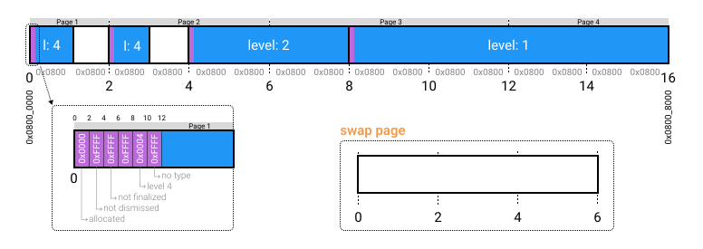

**First Block**  
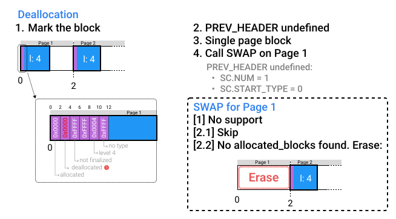

**Second Block**  
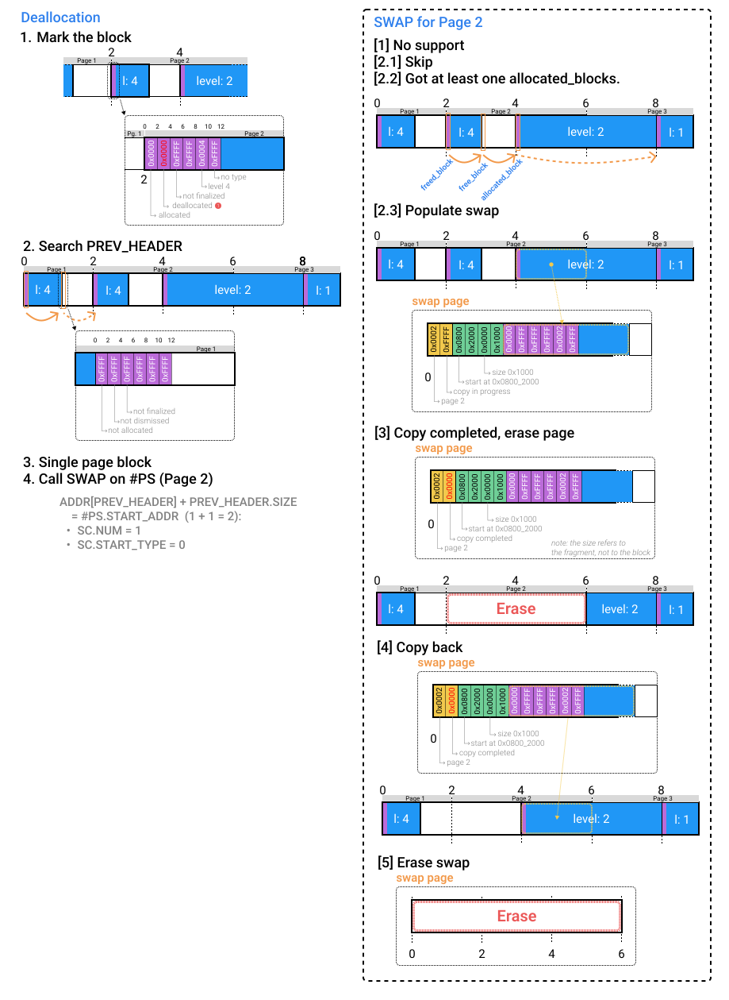

**Third Block**  


## Kernel Flash Conflicts
Also the Kernel needs space (at the beginning of the Flash).
Two approaches are possible here, depending on the resources available:
- the most naive solution, in case of a big Flash Memory, is to allocate only a subregion of Flash to the buddy allocator. **The main problem with this approach is that the base of this subregion must be naturally aligned with the size (or all the reasoning about MPU requirements will be void).** This dramatically reduces the Flash that will be available for the components (half the size of the Flash).
- the other approach is to assign to the allocator all the available Flash, but then during initialization of the allocator, as first step, allocate the Flash needed by the kernel, by starting reading metadata at a fixed location. (**rounded up the the end of the last flash page of the kernel**) (hard-coded, or asked via a syscall). **This is the approach we took when we developed code**.