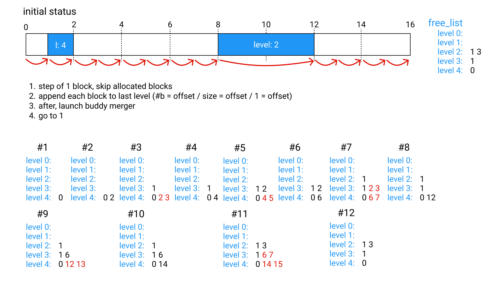

# Flash Memory
On STM32 boards, programs are stored in Flash Memory. They can be also directly executed from Flash: SRAMs are usually too small to fit also the code, and are reserved only for stacks/runtime data.

## Flash Programming
Flash memory differs from standard memory for what concerns writes. 

In order to reprogram flash memory, an `in-application programming (IAP)` is needed: IAP allows the user to re-program the Flash memory while the application is running (*the CPU will likely stall during the operation*).

Flash memory is divided into erase sectors, which can be in some cases also of different sizes and rather large (es. STMF4, STMF7, ...).

- An erase sector is the minimum granularity for an erase operation. *Erasing a sector sets all bits in the sector to 1*.

- Writes must be performed with the granularity of the specific Flash memory (in some cases can be modified using an apposite register for parallelism). Usually goes from a byte (*8 bits*) to a full word (*32 bits*).

- When setting bits from 1 to 0 no erase is required, if the hardware supports it. But it's not possible to perform the opposite operation without erasing the whole sector first.

### STM32 Flash
On some devices, STM adopted a more strict specification for the Flash controller: given the minimum write granularity, it's not possible to write twice to the same word (after an erase). The only exception is writing 0x0000, that is always accepted.

*Example (F303RE): the minimum write granularity is half-word (16 bits). After the page is erased, all half-words are 0xFFFF. The following transition is accepted: 0xFFFF -> 0xXXXX -> 0x0000*

*Example (F401RE): hardware supports the full specification. After the page is erased, all half-words are 0xFFFF. The following transition is accepted: 0xFFFF -> 0xFFFE -> 0xFFFC -> ... -> 0x0000*

All these operations are possible by exploiting the memory-mapped registers of the IAP (`FLASH_SR`, `FLASH_CR`, ...). But first the flash must be unlocked using the ad-hoc key for `FLASH_KEYR`.
By setting the `PG` flag (programming flag) in the register `FLASH_CR`, after the unlock procedure, it's possible to issue a write to the corresponding flash location, with the right granularity.

Flash memory of some devices sometimes are shipped with ECC flash memory (8 additional bits every 64bits of CRC). **In order to support these devices, each flag below must be set to the size of the data covered by a single ECC control word (in this case 64bits)**.

## Flash Layout
The minimum erase granularity complicates the operations needed in order for the system to be updated.

The only hard constraint for the positioning of the code in flash (for Cortex-M4), is the following initial layout:


For simplicity, we can start placing all the Kernel code at the beginning of the Flash, along with all entry-points needed by the hardware (*HardFault, DefaultHandler, ...*)

```
+--------------+------+------....
|  0x08000000  | .... |
+--------------+------+------....
|    IVT + Kernel     |
+--------------+------+------....
```

The Kernel can now start, but in order to have a functioning systems also Components must be loaded. Components are also placed in Flash as `HBF` files (see `toolchain/HubrisBinaryFormat.md`).

From a design perspective:
- the kernel must be able to find these HBF binaries in flash. As the system can be updated, this information is not known a priori, and must be stored itself in flash.
- as Memory Protection Unit (MPU) is adopted to increase reliability, HBF must be placed in a way to satisfy MPU strict requirements on *Base Address* and *Size*.
- HBF must be placed in memory in a way to control fragmentation, or the system can rapidly become impossible to be updated.

### MPU Requirements
The MPU shipped on board of STM32 Cortex-M4 has quite strict requirements.
Up to max 8 regions can be created. Each region can be then split into 8 subregions (each can be enabled/disabled).
Each region:
- has a start address that must be multiple of the MPU size (natural alignment).
- has a size that must be 2^n x 32 bytes.

The main problem for space allocation is the fact that as the size needed by a component increases, we start having less and less suitable base addresses.

## Buddy Allocator
We consider a modified version of this simple allocator, as:

- it allows compaction of memory with little overhead, at the same time showing a little [external fragmentation](https://en.wikipedia.org/wiki/Fragmentation_(computer)#External_fragmentation).
Problems of internal fragmentation are inevitable. 

- if the start address for the allocations is naturally aligned to the size, all splits will be placed to addresses naturally aligned with that split size (see [here, section 1.1](https://cs.au.dk/~gerth/papers/actainformatica05.pdf)). This is great as satisfies as side effect the MPU requirements.

See `RAMMemory.md` for details.

### Storing metadata
One of the critical aspects of the allocator is the ability to reconstruct flash state after an hard reboot. Two different strategies can be used:
- store the metadata about flash layout in a dedicated flash area, with a journaling fashion.
- store the metadata at the beginning of a block itself. As metadata changes always refer to the block we are working on, this avoids the need to have a complex filesystem. The drawback is consuming space of the block.

This second option is considered, due to the constraint resources of the STM32 devices. Each block (apart from the one dedicated to the kernel, more later) starts with an header. This header must be aligned to 4 in size, to avoid problems later.

>The following block header could be further compressed in device that supports the full flash specification (F4, F7, ...). Here is kept generic, assigning to each flag half-word (16bits, 2bytes).

Offset| Size (bytes) | Field Name  | Possible Values |            Content           |
------|--------------|-------------|-----------------|------------------------------|
0x00  |      2*      | Block Allocated | 0xFFFF = block not allocated<br> 0x0000 = block allocated | Flag meaning this block was once allocated. `Block Level` can be used to determine the allocated size (in use).
0x02  |      2*      | Block Dismissed | 0xFFFF = block not dismissed<br> 0x0000 = block dismissed | Flag meaning this block was then deallocated. `Block Level` can be used to retrieve the old size of the block. 
0x04  |      2*      | Block Finalized | 0xFFFF = block not finalized<br> 0x0000 = block finalized | Flag meaning all the information has been written successfully in this block, and so it's ready to be used. **On start-up, all allocated blocks that are not finalized are marked `DISMISSED`.**
0x06  |      2*      | Reserved |  | Flag reserved for future usages (now used for alignment)
0x08  |      2       | Block Level | 0x0000 to 0xFFFF | Integer value representing the level of this block, used to derive the size
0x0A  |      2       | Block Type | 0x0000 to 0xFFFF | Flags representing the destination usage of this block

In particular:
- `Block Type`: Represents information to understand the content of the block. Bits are set low, (0 = on, 1 = off).
    | 15 |...| 7 | 6 | 5 | 4 | 3 | 2 | 1 |     0     |
    |----|---|---|---|---|---|---|---|---|-----------|
    | R  | R | R | R | R | R | R | R | R | COMPONENT |
    
    where:
    - `COMPONENT` means this block contains the code of a component, so an Allocated RAM Base + HBF is expected after the header.

Total size: 12 bytes

**Note: values with * must be set to a multiple of the minimum granularity of flash write, in case of special devices that requires writing more than 2bytes (half-word) at a time**

### Reconstructing State from Metadata
It's always possible to retrieve the `free_list` from the flash memory upon start-up, using the following procedure:



### Changes to the algorithm
Let's define:
- A `free_block` is a block that was erased, and that can be written in any location. It's not assigned yet. (`ALLOCATED = 0`, `DISMISSED = 0`)
- An `allocated_block` is a block that was allocated, so we must presume it was written. It's locked and cannot be modified. (`ALLOCATED = 1`, `DISMISSED = 0`)
- A `freed_block` is an `allocated_block` after deallocation for it is requested. We must presume it was written, so cannot be used before being erased again. (`ALLOCATED = 1`, `DISMISSED = 1`)

The key principle are the following:
1. we assume the memory was initially completely erased.
2. upon any block deallocation, we have two possible behaviors:
    1. the page containing this `freed_block` contains only `freed_blocks` or `free_blocks`. In this case, we erase the page, and add all the corresponding blocks back into the `free_list`, as  now they are `free_blocks`
    2. the page containing this `freed_block` contains at least one `allocated_block`. In this case, we act lazy and do nothing, apart marking `DISMISSED = 1` on the block
3. upon any block allocation, we search for a candidate `free_block` in the `free_list`. If no block of the requested size is found, try to split another block from an upper `level` of the `free_list`. It's the same behavior of the standard case. If no such block is found, we have two cases:
    - we actually have no more memory, the request fails.
    - we have some memory, but this cannot be used before the recollection process. Launch the process, then try again the request.

#### Memory Scan and Recollection
This process is executed lazily at the first time the memory allocation fails. It proceeds as following:

**Scan phase:**
1. Read the first block header at the beginning of the memory area managed by this allocator. Scans the whole flash sector, searching for a block with `DISMISSED = 1`. If such block is found, remember whether this sector contains a `freed_block` is in a temp SRAM list (one flag per sector)
2. If we find a `freed_block`, jump directly to the next sector, and continue. Otherwise jump by one block at a time, skipping `allocated_blocks`.

**Recollection phase:**
1. Erase the swap block.
2. Start from the first page again. If the page was marked, then copy all blocks to swap if they have are `allocated_blocks`. After the page is copied, erase the page and copy back the `allocated_blocks`. Add the `freed_blocks` (now `free_blocks`) to the `free_list`.
3. Continue for each flash sector after this.

**Notes:**
When performing a swap operation, the component contained (or overlapping with) the sector under process must be put on hold. Actually the flash write operation itself should stall the CPU, but alone is not enough: **swap itself must be managed by the kernel, to enable swapping the block of this component**.

#### Swapping
As anticipated, swapping must be supported at kernel level, in order to be able to swap the block of the Flash component itself during the process of recollection.
The system must also have the ability to recover from this operation if a fault (and reboot) occurs.

##### System Call
Three fields must be provided to this system call:
- A 16bit number indicating the flash page to be processed. The maximum number of supported pages is *2^16 -2* = 65534 (0xFFFE)
- An additional 8bit number indicating:
    - `0` whether this page starts with a valid header
    - `1` whether this page starts with data that must be preserved (in this case, its length must be indicated in the next integer)
    - `2` whether this page start with data that must not be preserved (in this case, its length is interpreted as how many bytes to skip to get the next valid header, if any. If none, the page length)
- A 32bit integer indicating the length as specified for option `1` and `2`. For option `0` it's a don't care (put 0x0000_0000)

##### Algorithm
The procedure involves the following steps:
1. the kernel ensures the swap page is erased (should always be, or enters recover procedure).
2. *if context switches are allowed during this procedure, the kernel scans the list of active components, determining for each if their code actually intersect with this page (by using the address of their HBF + their size). Any involved component is temporarily put on hold (will not be scheduled in a context switch).*
3. writes the flash page number of the target page being swapped in the beginning of the swap page (`PAGE_NUM`).
4. begin scanning the page, copying only `allocated_blocks` (`ALLOCATED=1 DISMISSED=0`). To this purpose, it uses the information provided to the system call to detect correctly where to start reading headers. 
Before start copying each block (or part of a block), called `fragments`, the kernel writes in the flash the target address for the copy back (`TA`). Then the actual data copy begins (in `Data`).
When the copy of a fragment is completed, it writes its size into `FS`.
5. when the copy of all fragments is completed, the kernel sets `COPY_COMPLETED` into `SWAP_FLAGS`, erases the original page, and copy back data from the swap page (following target addresses and sizes)
6. at the end of the process (when all fragments have been copied back), the swap page is erased.

The swap layout is the following:
```
    | 2 bytes*  |    2 bytes*    | 4 bytes* | 4 bytes* | ...  | ... | 4 bytes | 4 bytes | ...  |
    | PAGE_NUM | COPY_COMPLETED |   TA    |   FS    | Data | ... |    TA   |    FS   | Data |
    |                           |                          |     |
    |                           |                          |     \-> fragment N start
    \-> swap page start         \-> fragment 1 start       \-> fragment 2 start
```
where:
- `PAGE_NUM` contains the page number of the page under swapping.
- `COPY_COMPLETED` (*0xFFFF = 0, 0x0000 = 1*) means the swap page is filled with all the data of the target page, copy back can start or is in progress.
- `TA` is the target address of the following fragment (= where to copy).
- `FS` is the size of the following fragment (= how much to be copied). **It's written after the data has been copied to the fragment, so if it's present, then it means the fragment is valid**
- `Data` contains the actual fragment data.

*Note: the swap procedure must be called on a page with at least a `freed_block` or `free_block`, as should always be the case. The corresponding data is not copied to swap, and this space can be used for the headers of the swap. Otherwise there is not enough space in swap, and the whole operation will fail: the kernel can be as careful as it wants during the process, actually managing this corner case.*

**Note: values with * must be set to a multiple of the minimum granularity of flash write, in case of special devices that requires writing more than 2bytes (half-word) at a time**

##### Recovery Procedure
At system start-up, the kernel:
1. checks the first word of the swap (`PAGE_NUM` and `SWAP_FLAGS`).
   If the first *16bits* (or the corr. length) are:
    - 0xFFFF this means the swap was erased correctly, and no recovery procedure is necessary: exit procedure. *No page with this number is supported by the system*
    - different from 0xFFFF, a swap operation was interrupted. Go to point 2
2. checks the other *16bits* (or the corr. length) (`SWAP_FLAGS`). If `COPY_COMPLETED` is:
    - not set, then the copy of the page in swap was still not completed: the original page is still intact, erase swap page and exit procedure.
    - set, then the original page may or may not have been erased, but all data is present in the swap. Go to point 3.
3. erases the destination page, then reads each fragment, and copy it back. At the end of the process, erase the swap page.

*Note: the process can be more conservative if at the beginning of point 3 we avoid erasing the destination page, and simply start to copy data back by comparing first each byte of the source (swap) and destination. This could actually perform no copy at all if the page was not yet erased, or behave exactly like point 3 with more overhead. The only problem is a reboot that happened during a page erase operation, that could have brought the page into an unsafe state: better erase everything at the beginning to be sure.*

#### A simpler solution
If the Flash memory has erase sectors of constant size (possibly small), this becomes easier. For example, considering `STM32F303E` (that can be found on the `NUCLEO-F303RE`), these blocks are 2Kb in size (see [here](https://www.st.com/resource/en/reference_manual/dm00043574-stm32f303xb-c-d-e-stm32f303x6-8-stm32f328x8-stm32f358xc-stm32f398xe-advanced-arm-based-mcus-stmicroelectronics.pdf)):

| Address Range             | Size (bytes)  |  Name     |
|---------------------------|---------------|-----------|
| 0x0800 0000 - 0x0800 07FF |  2K           | Page 0    |
| 0x0800 0800 - 0x0800 0FFF |  2K           | Page 1    |
| 0x0800 1000 - 0x0800 17FF |  2K           | Page 2    |
| 0x0800 1800 - 0x0800 1FFF |  2K           | Page 3    |
|   .............           |  2K           | ......    |
| 0x0807 F800 - 0x0807 FFFF |  2K           | Page 255  |

The problem of swapping can be easily avoided by having a minimum granularity in the allocation of 2Kb, so each page deallocated can be directly erased without swapping first.

### Kernel Flash Conflicts
Also the Kernel need space (at the beginning of the Flash).
Two approaches are possible here, depending on the resources available:
- the most naive solution, in case of a big Flash Memory, is to allocate only a subregion of Flash to the buddy allocator. **The main problem with this approach is that the base of this subregion must be naturally aligned with the size (or all the reasoning about MPU requirements will be void).** This dramatically reduces the Flash that will be available for the components (half the size of the Flash).
- the other approach is to assign to the allocator all the available Flash, but then during initialization of the allocator, as first step, allocate the Flash needed by the kernel (hard-coded, or asked via a syscall).
